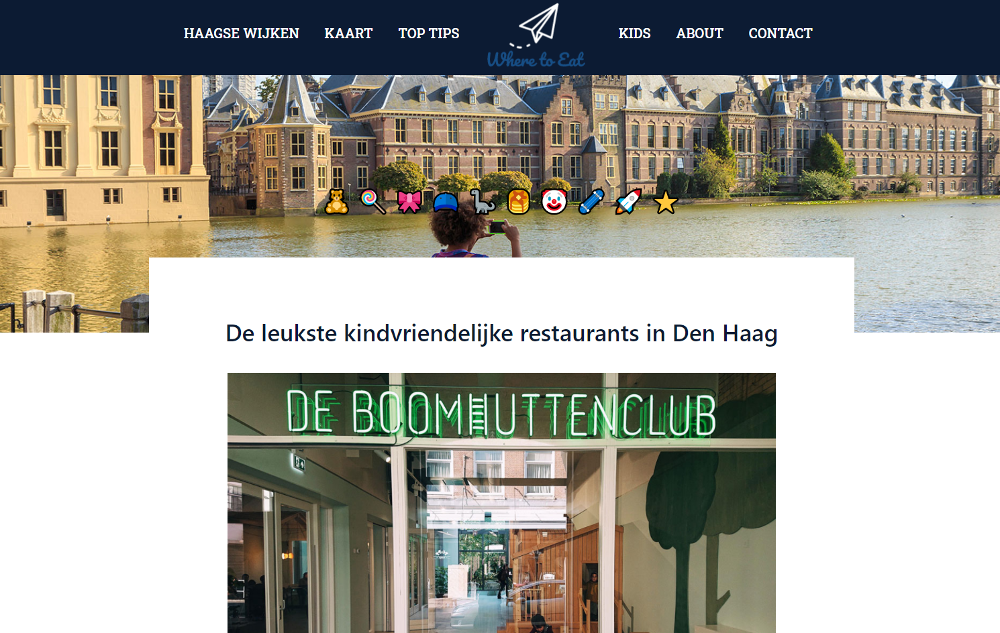

# Short Description:
Where To Eat is a website. Its purpose is give great advice about the highlights in the Hague (a city in the Netherlands). The highlights can be anything from restaurants, recreational areas, cocktail bars, etc. The website was built in HTML, CSS and Javascript. Bootstrap framework has been used as well. 

# Getting Started as a developer:
git clone or pull the project. No frameworks except for Bootstrap had been used. 
```sh 
git clone
```

# Screenshots:


